## 1. PENDAHULUAN

### 1.1 Latar Belakang

Pemanfaatan Teknologi Informasi (TI) di lingkungan Pemerintahan Provinsi Banten terkait dengan manfaat TI sebagai sarana penunjang kegiatan pelaksanaan tugas pokok, fungsi dan pelayanan publik di Pemerintahan provinsi Banten. Khusus menyangkut kebijakan tata kelola, pemerintah dalam hal ini Pemerintah Provinsi Banten Dinas  Komunikasi dan Informatika telah mengeluarkan Peraturan Menteri Kominfo No.41 Tahun 2007 tentang Panduan Umum Tata Kelola TIK Nasional. Aturan ini berdasarkan peruntukkannya ditujukan bagi seluruh instansi pemerintah di semua level, yakni Pemerintah Provinsi Banten atau LPND di tingkat pusat, provinsi, dan kabupaten/kota. Penerapan dan pemanfaatan TIK dalam sebuah organisasi harus didukung dengan tata kelola TIK yang baik, agar pemanfaatan TIK betul-betul efektif dan efisien dalam mencapai tujuan organisasi. Beberapa negara maju seperti Amerika Serikat, Australia, dan negara lainnya sudah memunyai dan menerapkan dengan baik standar tata kelola TIK yang dirancang untuk negaranya masing- masing.  

Peraturan Menteri Kominfo No.41 Tahun 2007 tentang Panduan Umum Tata Kelola TIK Nasional yang dikeluarkan Pemerintah Provinsi Banten Komunikasi dan Informatika merupakan standar tata kelola yang resmi yang bisa dijadikan acuan setiap instansi pemerintah dalam menata kelola TIK di lingkungannya masing-masing.  

Implementasi Peraturan Menteri Kominfo tersebut di masing-masing instansi pemerintah perlu dievaluasi, untuk mengetahui apakah peraturan menteri tersebut sudah cukup baik ataukah memerlukan revisi atau perubahan. Selain itu, masing-masing instansi pemerintah bisa melakukan evaluasi tata kelola TIK berdasarkan peraturan menteri tersebut untuk mengukur serta meningkatkan kinerja instansinya.  

Perubahan Stuktur Organisasi Tata Kerja (SOTK) di pemerintahan Provinsi Banten sebagaimana tertuang di.... 

## Maksud dan Tujuan

#### 1.1.1 Maksud Kegiatan

Maksud dari kegiatan ini adalah tersusunnya  Pedoman Teknis Tatacara Kelola TIK di Provinsi Banten meliputi : (a) arah kebijakan strategis Teknologi Informasi, (b) strategi pengembangan Teknologi Informasi , (c) konsep arsitektur  Teknologi Informasi, (d) roadmap pengembangan Teknologi Informasi berdasarkan skala prioritas.

#### 1.1.2 Tujuan

Tujuan yang akan dicapai melalui Penyusunan Pedoman Teknis Tata kelola TIK adalah dapat membantu:

a. Mewujudkan pembangunan dan pengembangan aplikasi sistem informasi yang selaras (alignment) dengan visi dan misi dan tupoksi Diskominfo Terbentuknya integrasi sistem eksisting dengan sistem yang akan dibangun .

b. Terbentuknya pembangunan infrastruktur dan jaringan komunikasi data baik internal maupun eksternal .

c. mewujudkan SDM (Sumber Daya Manusia) yang memiliki pengetahuan dan  keahlian dibidang Teknologi Informasi dan Komunikasi.

d. Memanfaatan teknologi informasi dan komunikasi untuk mendukung kegiatan operasional pelayanan prima.

e. Memetakan seluruh aspek IT yang terpasang sekarang ini dengan benar dibandingkan dengan Best Practice yang seharusnya diimplementasikan.

f. Membantu memberikan landasan teknis terhadap program – program teknologi informasi yang direncanakan, untuk mengurangi resiko kegagalan implementasi program tersebut.

g. Melakukan review Master plan sebelum kemudian menyesuaikan dengan kebutuhan serta arah kebijakan organisasi pemerintahan saat ini.

#### 1.1.3 Sasaran

Sasaran dari penyusunan Penerapan dan pemanfaatan TIK dalam sebuah organisasi harus didukung dengan tata kelola TIK yang baik, agar pemanfaatan TIK betul-betul efektif dan efisien dalam mencapai tujuan organisasi. Beberapa negara maju seperti Amerika Serikat, Australia, dan negara lainnya sudah memunyai dan menerapkan dengan baik standar tata kelola TIK yang dirancang untuk negaranya masing- masing.  

Peraturan Menteri Kominfo No.41 Tahun 2007 tentang Panduan Umum Tata Kelola TIK Nasional yang dikeluarkan Pemerintah Provinsi Banten Komunikasi dan Informatika merupakan standar tata kelola yang resmi yang bisa dijadikan acuan setiap instansi pemerintah dalam menata kelola TIK di lingkungannya masing-masing.  

Kerangka Acuan Kerja Penyusunan Pedoman Teknis Tata Kelola TIK ,merupakan sebagiandari Implementasi Peraturan Menteri Kominfo tersebut, di masing-masing instansi pemerintah perlu dievaluasi, untuk mengetahui apakah peraturan menteri tersebut sudah cukup baik ataukah memerlukan revisi atau perubahan. Selain itu, masing-masing instansi pemerintah bisa melakukan evaluasi tata kelola TIK berdasarkan peraturan menteri tersebut untuk mengukur serta meningkatkan kinerja instansinya.  

Sasaran inti Penyusunan Pedoman Teknis Tata kelola TIK ini adalah:

a) Terwujudnya integrasi sistem eksisting dengan sistem yang akan dibangun.
b) Terwujudnya pembangunan infrastruktur dan jaringan komunikasi data baik internal maupun eksternal.

### 1.2 Ruang Lingkup Kegiatan

Ruang lingkup pekerjaan adalah Penerapan dan pemanfaatan TIK dalam sebuah organisasi harus didukung dengan tata kelola TIK yang baik, agar pemanfaatan TIK betul-betul efektif dan efisien dalam mencapai tujuan organisasi. Beberapa negara maju seperti Amerika Serikat, Australia, dan negara lainnya sudah memunyai dan menerapkan dengan baik standar tata kelola TIK yang dirancang untuk negaranya masing- masing.  

Peraturan Menteri Kominfo No.41 Tahun 2007 tentang Panduan Umum Tata Kelola TIK Nasional yang dikeluarkan Pemerintah Provinsi Banten Komunikasi dan Informatika merupakan standar tata kelola yang resmi yang bisa dijadikan acuan setiap instansi pemerintah dalam menata kelola TIK di lingkungannya masing-masing.  

Kerangka Acuan Kerja Penyusunan Pedoman Teknis Tata Kelola TIK adalah merupakan Implementasi Peraturan Menteri Kominfo tersebut, di masing-masing instansi pemerintah perlu dievaluasi, untuk mengetahui apakah peraturan menteri tersebut sudah cukup baik ataukah memerlukan revisi atau perubahan. Selain itu, masing-masing instansi pemerintah bisa melakukan evaluasi tata kelola TIK berdasarkan peraturan menteri tersebut untuk mengukur serta 
Kerangka Acuan Kerja Penyusunan Pedoman Teknis Tata Kelola TIK adalah merupakan Implementasi Peraturan Menteri Kominfo tersebut, di masing-masing instansi pemerintah perlu dievaluasi, untuk mengetahui apakah peraturan menteri tersebut sudah cukup baik ataukah memerlukan revisi atau perubahan. Selain itu, masing-masing instansi pemerintah bisa melakukan evaluasi tata kelola TIK berdasarkan peraturan menteri tersebut untuk mengukur serta meningkatkan kinerja instansinya.  
 meningkatkan kinerja instansinya.  
 
Yang mampu menjawab permasalahan, tujuan dan sasaran yang akan dicapai oleh penyusunan tersebut,yaitu mencakup hal – hal yang perlu diperhatikan antara lain :

a. Melakukan assessment terhadap kondisi eksisting di lingkungan SKPD Provinsi Banten terkait pemanfaatan teknologi, informasi dan komunikasi (TIK) serta kebutuhan dari user/SKPD.

b. Menyusun Strategi Pengembangan Teknologi Informasi untuk 5 (lima) tahun mendatang. Arsitektur teknologi Informasi adalah desain konseptual atau kumpulan relasi diantara bagian-bagian sistem. Arsitektur ini dapat didefinisikan sebagai representasi dari sistem yang akan di buat atau sistem yang telah ada, dan proses juga cara terbaik dalam mengimplementasikan desain untuk sistem tersebut. Kumpulan dari relasi yang di terangkan oleh arsitektur sistem tersebut dapat di gambarkan dalam perangkat lunak, perangkat keras atau dalam hal lain nya seperti manajemen organisasi, dan lain-lain.

Arsitektur teknologi informasi dapat dikategorikan menjadi 4 (empat), yaitu:

1. Arsitektur Informasi
2. Arsitektur Aplikasi
3. Arsitektur Organisasi TI
4. Arsitektur Infrastruktur

c. Menyusun rekomendasi kondisi ideal tata kelola pengembangan sistem informasi / aplikasi / infrastruktur / organisasi sebagai solusi potensial yang sesuai dengan kebutuhan masing2 SKPD, meliputi :

- Roadmap Implementasi Program (sasaran, ukuran kinerja, kegiatan program, lama kegiatan)
- Analisa Estimasi Biaya Program
- Strategi Implementasi Program
- Kebijakan pemanfaatan teknologi informasi (IT Policy) terkait pemanfaatan hardware dan software di lingkungan Diskominfo.

d. Melakukan sosialisasi terhadap Tata Kelola TIK terkini kepada stakeholder di lingkungan terkait.

### 1.3 Organisasi Pelaksanaan Pekerjaan

Penyusunan struktur organisasi pelaksana pekerjaan dimaksudkan untuk menciptakan sistem koordinasi yang terkendali dan sebagai usaha untuk melaksanakan pekerjaan seoptimal mungkin. Hal ini dimaksudkan agar pelaksanaan pekerjaan dapat berlangsung lancar, efisien, terintegrasi, dan selesai secara tepat waktu dengan menghasilkan keluaran seperti yang diharapkan.

Organisasi pelaksana pekerjaan Penyusunan pedoman Teknis Tata Kelola TIK di Diskominfo Provinsi Bantendisusun berdasarkan arahan yang terdapat dalam Kerangka Acuan Kerja khususnya pada ruang lingkup pekerjaan serta memperhatikan metodologi dan pendekatan pekerjaan yang diusulkan.

Pelaksanaan pekerjaan ini dilakukan dalam satu struktur organisasi, baik secara intern di dalam Konsultan sendiri yang melibatkan seluruh tenaga ahli yang dibutuhkan, maupun secara ekstern yang memperlihatkan keterkaitan antara Konsultan selaku pelaksana pekerjaan dengan Pemberi Tugas.

Sebagai pihak pelaksana pekerjaan, Konsultan membentuk organisasi tim pelaksana pekerjaan yang terdiri dari Ketua Tim Proyek (project team leader) sebagai penanggung jawab keseluruhan pekerjaan baik yang bersifat administratif maupun substantif. Dari tenaga-tenaga ahli yang ditugaskan untuk melaksanakan pekerjaan tersebut, Direktur akan menunjuk salah seorang tenaga ahli, sesuai dengan yang ditentukan dalam Kerangka Acuan Kerja, untuk menjadi Ketua Tim yang akan bertindak dan memiliki wewenang dan tanggung jawab untuk mewakili Pimpinan dalam seluruh pekerjaan ini. Tenaga ahli yang dipilih adalah sesuai dengan permintaan Kerangka Acuan Kerja yaitu memiliki pengalaman yang cukup di bidangnya.

#### 1.3.1 Struktur Organisasi

Berikut ini adalah struktur organisasi dan bagan koordinasi pada pekerjaan ini:

Gambar 1.1. Bagan Organisasi Proyek:

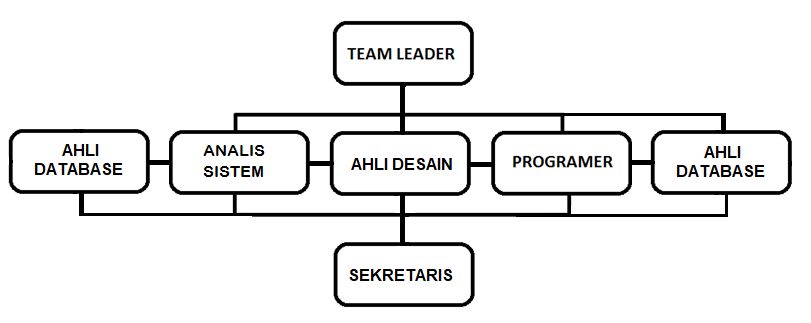

Gambar 1.2. Bagian Koordinasi Tim Konsultan & Tim Diskominfo Provinsi Banten:

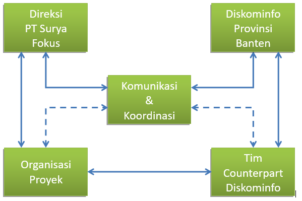

#### 1.3.2 Tugas dan Tanggungjawab

Sesuai dengan lingkup pekerjaan yang akan dilaksanakan, dan sesuai pula dengan kebutuhan tenaga ahli yang diperlukan untuk melaksanakan pekerjaan ini, maka untuk melaksanakan pekerjaan ini akan dibentuk tim yang terdiri dari para ahli yang sesuai dengan bidangnya masing-masing.

Pembagian tugas dari masing-masing tenaga ahli dan tenag pendukung adalah sebagai berikut:

Tabel 1.1 Tenaga Ahli dan Tenaga Pendukung-Fungsi dan Tanggungjawab:

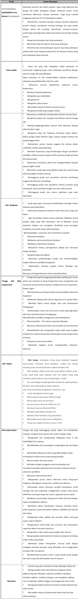

### 1.4 Lokasi Kegiatan

Pola kerja yang akan digunakan oleh PT. Surya Fokus Teknologi dalam pekerjaan ini adalah sebagai berikut:

1. Seluruh kegiatan analisa, pengkajian , pemodelan dan pengembangan sistem informasi akan dilakukan di Kantor Konsultan.
2. Untuk kegiatan-kegiatan quistioner, data colection,survey2 dan yang memerlukan konfirmasi serta pelaporan hasil pekerjaan akan dilakukan di lokasi/kantor Diskominfo Provinsi Banten.

## 2. RENCANA PELAKSANAAN PEKERJAAN

Pelaksanaan pekerjaan secara keseluruhan terdiri dari tahapan inisialisasi proyek, analisis sampai kepada penyusunan rancangan strategis serta roadmap pengembangan teknologi informasi. Tahapan-tahapan dikelompokan menurut jenis pekerjaannya.

### 2.1 Inisialisasi Kegiatan

Kegiatan utama pada tahap ini adalah _Project Kickoff_ sebagai tanda dimulainya proyek. Hal yang paling penting dilakukan pada tahap ini adalah menjelaskan substansi kegiatan, rencana kerja dan keluaran kegiatan kepada pihak pemilik pekerjaan serta menyusun Laporan Pendahuluan yang berfungsi sebagai pedoman bagi konsultan maupun pemilik proyek dalam melaksanakan proyek. Hal – hal penting yang diatur dalam kegiatan ini meliputi:

1. Mendefinisikan Tujuan proyek.
2. Menyusun ruang lingkup.
3. Menyusun penjelasan deliverable.
4. Menyusun Organisasi Proyek.
5. Menyusun Rencana Pelaksanaan Proyek.
6. Menyusun Jadwal Pelaksanaan Proyek.
7. Menyusun Metolologi Pelaksanaan.

### 2.2 Survey dan Koleksi Data

Tahap ini dimaksudkan untuk memperoleh informasi yang memadai mengenai kondisi pemanfaatan Teknologi Informasi saat ini. Kegiatan ini dilaksanakan dengan cara pengumpulan dokumen terkait yang berlaku, Wawancara, _Focus Group Discussion_ (FGD), penyusunan _questionaire_, dan cara lainnya yang memungkinkan.

Pengumpulan data dan informasi ini terkait dengan informasi Penyusunan Tata Kelola TIK  Diskominfo Provisi Banten dari berbagai aspek yaitu Identifikasi Visi dan Misi, data tugas, pokok, dan fungsi (tupoksi) masing-masing elemen organisasi serta identifikasi butir-butir kegiatan, proses bisnis, data, aplikasi, SDM, infrastuktur, peraturan, dan dokumen acuan lainnya yang berlaku.

### 2.3 Analisa Data

Pada proses ini dilakukan kajian mengenai data/informasi/dokumen yang diperoleh, meliputi aturan-aturan pemanfaatan Teknologi Informasi yang digunakan, standard-standard yang akan dijadikan acuan, kondisi eksisting penggunaan teknologi informasi dan komunikasi. Termasuk dalam hal ini adalah kebutuhan mendesak dan tantangan teknologi informasi untuk mendukung proses pelayanan terhadap masyarakat maupun dilingkungan kinerja Pemerintahan Provinsi Banten.

Rujukan metodologi analisis yang digunakan pada tahap ini adalah dengan menggunakan _Zachman Framework_ dan analisa resiko.

### 2.4 Perumusan Rancangan Penyusun Pedoman Teknis Tata Kelola TIK

Pada tahap ini dilakukan perumusan Rancangan Penyusunan Pedoman Teknis TIK berdasarkan pada Visi dan Misi secara keseluruhan sebagai _Arsitektur Enterprise_.

_Arsitektur Enterprise_ merupakan identifikasi komponen-komponen utama dalam suatu organisasi atau suatu sub-set dari organisasi baik sistem informasinya serta kerjasama antar komponen-komponen (visi, misi, staff, proses bisnis, teknologi , informasi, keuangan dan sumber daya lainnya) yang terkait untuk mencapai arah obyektif bisnis atau sasaran tujuan .

Berikut ini adalah model dari perencanaan strategis antara lain :

- **_Goals-based planning model_** 
  Perencanaan model ini pada umumnya diawali dengan fokus terhadap misi dan visi , tujuannya adalah program kerja untuk menjalankan misi, strategi untuk mencapai tujuan dan action plan (siapa yang akan melakukan dan kapan waktunya) 
- **_Issued-based planning model_** 
  Perencanaan ini dimulai dengan melakukan pengujian/memeriksa persoalan yang dihadapi oleh Dikominfo khususnya dan Provinsi Banten umum nya , selanjutnya membangun strategi untuk mendapatkan persoalaan tersebut dan membuat action plan. 
- **_Organic planning model_** 
  Perencanaan model ini diawali dengan memaparkan visi dan value dari organisasi kemudian action plan digunakan untuk mencapai visi yang sepenuhnya terdapat pada values tersebut.
- **_Scenario planning model_** 
  Perencanaan model ini sudah diskenariokan dari awal oleh organisasi tersebut sehingga action plan ditujukan untuk mendapatkan tujuan sesuai dengan skenario.
  
Model dari proses pembuatan perencanaan strategis secara umum yang sering diimplementasikan oleh perusahaan–perusahaan besar sesuai dengan fokus bisnisnya, digambarkan sebagai berikut:

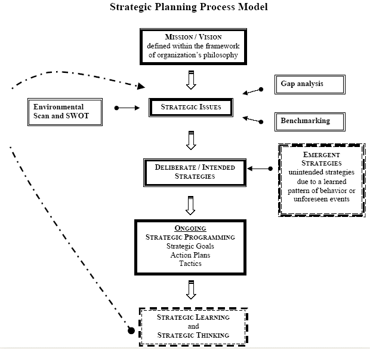

### 2.5 Penyusunan Draft Pedoman Teknis Tata kelola TIK Diskominfo Provinsi Banten

Setelah terdefinisinya Rancangan Penyusunan Pedoman Teknis Tata Kelola TIK, maka pada tahap ini rencana kerja yang diterapkan adalah melakukan penyusunan detil arahan program yang dijabarkan dalam jadwal pelaksanaan kegiatan (_roadmap_), strategi implementasi dan manajemen risiko dari program tersebut.

### 2.6 Evaluasi Hasil

Pada tahap ini dilakukan penilaian dan evaluasi terhadap rekomendasi Penyusunan Pedoman Teknis Tata Kelola TIK ,yang diusulkan dan merekam masukan-masukan untuk penyempurnaan dokumen.

### 2.7 Finalisasi

Merupakan tahap akhir dari pelaksanaan proyek, pada tahap ini dilakukan finalisasi terhadap Draft Penyusunan Pedoman Teknis Tata Kelola TIK,dan menyusun Laporan Final dalam bentuk Dokumen Teknis.

### 2.8 Pelaporan dan Dokumentasi

Sistematika, tahap, dan prosedur pelaporan adalah sebagai berikut:

- **Laporan Pendahuluan** 
  Laporan pendahuluan di dalam pekerjaan ini berisikan mengenai latar belakang, tujuan pekerjaan, gambaran umum perencanaan, ruang lingkup pekerjaan metodologi pekerjaan, organisasi proyek dan tahapan pelaksanaan pekerjaan serta hasil yang diharapkan dari pekerjaan ini. Laporan ini  berjumlah 10 (sepuluh) eksemplar. 
- **Laporan Akhir/Dokumen Penyusunan Pedoman Teknis Tata Kelola TIK** 
  Dokumen yang berisi alur Penyusunan Pedoman Teknis Tata Kelola TIK , kebutuhan mendesak , daftar inisiatif program, roadmap pengembangan, prioritas pengembangan melalui identifikasi risiko, landasan teknis dari  pengembangan dari masing – masing program kegiatan. Jumlah buku laporan akhir sebanyak  10 (sepuluh) eksemplar.
  
### 2.9 Rencana Jadwal Kegiatan

Jadwal pekerjaan proyek dihitung berdasarkan jumlah sumber daya proyek (_full time equivalent_). Proyek dianggarkan untuk berjalan selama kurang lebih 1 (Satu) bulan kalender atau 30 hari kalender, _Gantt Chart_ berikut ini memberikan gambaran yang lebih terperinci tentang kegiatan yang dilakukan selama proyek, beserta dengan perkiraan waktunya.

Jadwal pekerjaan proyek dihitung berdasarkan jumlah sumber daya proyek (full time equivalent). Proyek dianggarkan untuk berjalan selama kurang lebih 1 (Satu) bulan kalender atau 30 hari kalender, Gantt Chart berikut ini memberikan gambaran yang lebih terperinci tentang kegiatan yang dilakukan selama proyek, beserta dengan perkiraan waktunya.

tabel jadwal kegiatan

## 3. PENDEKATAN DAN METODOLOGI PELAKSANAAN

Sesuai dengan yang telah dipaparkan sebelumnya, kegiatan ini pada hakekatnya memiliki tujuan untuk menghasilkan **Penyusunan Pedoman Teknis Tata Kelola TIK**. Proses penyusunan cetak biru ini tentunya memerlukan metodologi yang tepat sehingga dapat menghasilkan hasil yang sesuai dengan yang diharapkan sesuai visi dan misi Diskominfo dan Pemerintahan Provinsi Banten serta mampu mengikuti perkembangan teknologi informasi yang dinamis dengan mempertimbangkan segenap aspek yang terkait dengan kebutuhan sistem.

### 3.1 Pendekatan Teknis

Berbicara tentang implementasi teknologi informasi, maka akan dihadapkan pada ruang lingkup teknologi informasi; banyak model pendekatan yang bisa digunakan dalam teknologi informasi, salah satunya adalah pendekatan _Five resources components_ (5 komponen sumberdaya teknologi informasi) yang lazim digunakan para pelaku bisnis teknologi informasi.

Berikut adalah diagram teknologi informasi sebagai processing tool dari sejumlah data menjadi informasi yang digunakan untuk _decision making_ dalam suatu PROSES IMPLEMENTASI:

Gambar 3.1 Information Technology Resource:

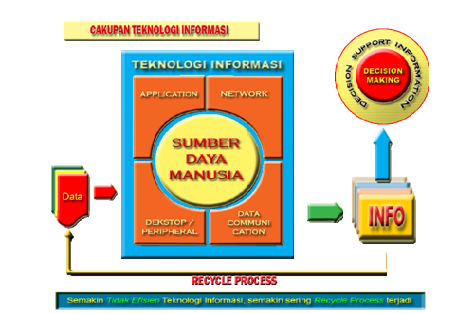

Mengacu pada pendekatan 5 komponen dasar sumber daya teknologi informasi tersebut, berikut adalah pokok-pokok pikiran yang sepatutnya bisa dijawab oleh Pengembangan Teknologi Informasi di Pemerintahan Provinsi Banten.

1. **_Application :_** 
   Sejauh mana tingkat keselarasan dan kelengkapan sistem aplikasi eksisting dapat memenuhi fungsi-fungsi yang dibutuhkan  dengan memuaskan serta dapat menyajikan suatu informasi strategis penunjang pengambilan keputusan?  
Seberapa tingkat keamanan aplikasi-aplikasi  yang berjalan saat ini, termasuk keamanan data, baik dari sisi Files Security, Application Security, Data Security maupun keamanan dari tangan-tangan jahil yang tidak punya otorisasi terhadap informasi tersebut? (hal ini penting karena berurusan dengan Data Pengguna jasa) ?  
Seberapa tingkat kesiapan dan kesulitan yang dihadapi oleh para pengguna komputer dalam menggunakan masing-masing aplikasi yang berjalan saat ini, baik dari sisi kelengkapan modul dan services process-nya, kemampuan aplikasi dalam menghasilkan laporan-laporan yang diperlukan, tingkat kemudahan masing-masing aplikasi untuk dipelajari, serta tingkat kenyamanan penggunaannya ?  
Sejauh mana resiko yang dihadapi apabila aplikasi tersebut rusak tidak bisa digunakan, dan jalan keluar apa yang akan disiapkan ?  
Sejauh mana tingkat kesulitan penggabungan dan konsolidasi berbagai data pengguna jasa dari berbagai aplikasi yang ada, untuk menyajikan informasi penunjang pengambilan keputusan pimpinan dapat dikendalikan.

2. **_Networking :_** 
   Sejauh mana kelengkapan infrastruktur jaringan komputer yang telah tergelar, dan seberapa jauh perbedaannya dengan Arsitektur Jaringan yang sebenarnya dibutuhkan ?  
Sejauh mana rentang jangkauan jaringan yang tergelar di masing-masing lokasi Kantor maupun SKPD , dan sejauh mana kinerja jaringan dapat memuaskan para pengguna komputer ?   
Seberapa kekuatan pusat data center pengendali jaringan komputer di Kantor maupun SKPD , seimbangkah dengan luas rentang jangkauan jaringan dan volume transaksi arus data yang memanfaatkan jaringan tersebut ?  
Seberapa tingkat keamanan jaringan yang tergelar saat ini, termasuk keamanan arus masuk data dan arus keluar data dari dan ke pusat pengendali jaringan di kantor Diskominfo ?  
Sejauh mana kesiapan menghadapi resiko-resiko bencana, dalam kaitannya penyelamatan data pengguna jasa guna menjamin keberlangsungan kegiatan perkantoran sebagai pelayan masyarakat ?

3. **_Data Communication :_** 
   Sejauh mana kelengkapan infrastruktur komunikasi yang telah tergelar, dan seberapa jauh perbedaannya dengan Arsitektur Komunikasi data yang sebenarnya dibutuhkan?  
Sejauh mana rentang jangkauan pipa komunikasi yang tergelar dan mampu mengkomunikasikan ujung-ujung pelayanan di cabang/ranting ke pusat pengendali jaringan di Kantor Wilayah, dan sejauh mana kinerja fasilitas pipa komunikasi tersebut dapat memuaskan para pengguna?   
Seberapa kapasitas pipa komunikasi (backbone) di lingkungan Pemerintahan Provinsi Banten yang telah tergelar, dan seimbangkah dengan luas rentang komunikasi yang harus dijangkau dan volume transaksi arus data maupun aplikasi yang memanfaatkan pipa komunikasi (backbone) tersebut ?  
Seberapa tingkat keamanan jalur komunikasi menuju ke dan dari pusat pengendali jaringan di kantor cabang yang tergelar saat ini, termasuk keamanan fisik data maupun aplikasi eksisting yang menggunakan pipa komunikasi tersebut ?  
Sejauh mana kesiapan menghadapi resiko-resiko bencana, dalam kaitannya dengan implementasi aplikasi guna menjamin keberlangsungan kegiatan dan kinerja Diskominfo Provinsi Banten sebagai pelayan pengguna jasa ?  

4. **_Hardware & Peripheral :_** 
   Sejauh mana kelengkapan, kapasitas dan standar konfigurasi sarana penunjang kegiatan pengguna komputer (Hardware & peripheral) yang tersedia di ujung layanan jaringan hingga ke Kantor Cabang dalam mendukung diimplementasikannya aplikasi ?  
Seberapa tingkat keamanan masing-masing hardware & peripheral selaku pengguna jaringan yang terhubung ke pusat pengendali jaringan di kantor wilayah, termasuk keamanan files, akses ke aplikasi, akses ke internet, dan penggunaan devices lainnya, terkait dengan implementasi aplikasi ?  
Sejauh mana kesiapan menghadapi resiko-resiko bencana, dalam kaitannya dengan usaha menjamin keberlangsungan kegiatan tata usaha langganan dan kinerja masing-masing pengguna komputer, sebagai pengelola data awal dalam proses penyajian informasi strategis untuk keperluan Pimpinan ?  

5. **_People (Sumber daya Manusia dan Organisasi):_** 
   Sejauh mana ketersediaan dan kesiapan sumberdaya manusia yang dibutuhkan berkaitan dengan pengembangan teknologi informasi dapat dipenuhi saat ini ?  
Seberapa tingkat pemahaman para pengguna komputer untuk mendayagunakan aplikasi sebagai tools penata usaha langganan, dalam rangka meningkatkan kinerja pribadinya ?  
Sejauh mana kesiapan para pengguna komputer menghadapi risiko-risiko bencana misalnya peripheral nya hancur/korap dan files penting (data pengguna jasa) yang bersifat strategis ada di dalamnya; dalam kaitannya dengan usaha menjamin keberlangsungan kegiatan dan kinerja masing-masing pengguna komputer sebagai penanggungjawab pengelolaan data pengguna jasa ?  
Sejauh mana kesiapan dan kesediaan dukungan teknis maupun program pelatihan dalam rangka memenuhi kebutuhan sumberdaya manusia yang sesuai kompetensi yang dibutuhkan untuk mengoperasikan sistem yang telah dicanangkan

### 3.2 Skenario dan Metodologi Pelaksanaan Pekerjaan

#### 3.2.1 Skenario Kegiatan Proyek

Skenario pelaksanaan kegiatan proyek ini dikembangkan berdasarkan sistematika langkah tindak yang lazim dipergunakan dalam proses penyusunan _Information Technology Blueprint_, yang dapat digambarkan dalam diagram sebagai berikut :  

Gambar 3.2. Skenario Kegiatan Proyek:

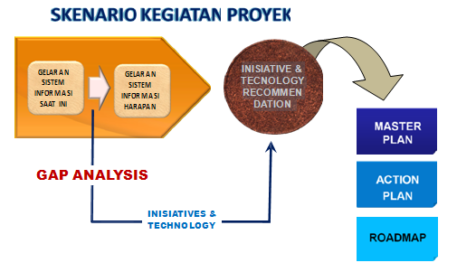

Pada hakekatnya, pendekatan teknis adalah tahapan atau fase-fase yang dijalankan secara berurutan agar sasaran proyek bisa tercapai. Sementara kerangka kerja merupakan aspek-aspek yang difokuskan dalam setiap fase yang ada.

Gambar 3.3. Kerangka Kerja:

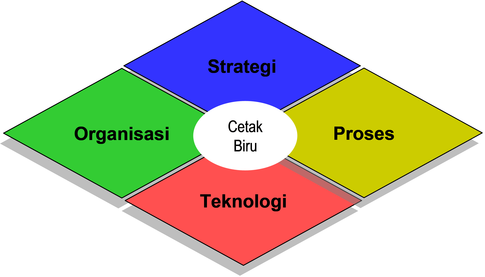

i. **Strategi** 
   Fokus Strategi adalah pada visi, misi dan sasaran TI, kebijakan yang perlu dibuat, rencana & tahapan pengembangan, rencana pemaduan sistem dan hal-hal lainnya yang bersifat strategis.
   
ii. **Organisasi** 
    Pada hakekatnya, pendekatan teknis adalah tahapan atau fase-fase yang dijalankan secara berurutan agar sasaran proyek bisa tercapai. Sementara kerangka kerja merupakan aspek-aspek yang difokuskan dalam setiap fase yang ada.

iii. **Proses** 
     Fokus Proses adalah pada penyesuaian solusi pada proses kerja yang ideal, penerapan teknologi untuk percepatan proses dan seterusnya.

iv.  **Teknologi** 
     Fokus Teknologi adalah pada aplikasi, basis data, infrastruktur jaringan, teknologi tepat guna dan tepadu.

#### 3.2.2 Metodologi Pelaksanaan Kegiatan

Agar pekerjaan dapat dilaksanakan secara efektif dan efisien, harus dibuat suatu metodologi pelaksanaan pekerjaan, yang mana metodologi yang dipergunakan dalam melaksanakan pekerjaan ini akan mempergunakan tahapan yang telah sering kali berhasil dipergunakan dalam menyusun suatu rancangan strategis pengembangan teknologi informasi dengan tujuan untuk mengurangi atau memperkecil risiko kegagalan yang seringkali terjadi pada project management yang buruk. Langkah atau tahapan metodologi pelaksanaan pekerjaan untuk proyek ini adalah sebagai berikut:

Gambar 3.4. Metodologi Pelaksanaan Pekerjaan:

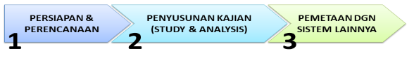

**Rincian Kegiatan:** 
    Lingkup Pekerjaan Penyusunan Pedoman Teknis Tata Kelola TIK mencakup antara lain kegiatan-kegiatan:

1. **PERSIAPAN DAN PERENCANAAN** 
   Untuk memulai kegiatan proyek Penyusunan Pedoman Teknis Tata Kelola TIK ini diperlukan persiapan dan perencanaan sebagai berikut: 
   a) Penyusunan kesepemahaman proyek _**(Project Charter)**_ untuk menyatukan pendapat tentang ruang lingkup proyek, jadwal  kegiatan yang ditetapkan dan kesepakatan apa saja yang termasuk dan tidak termasuk dalam kegiatan proyek.   
   b) Kesepakatan jadwal, Penyusunan tim dan petugas pendamping dari Diskominfo untuk menjamin kelancaran _assessment process_ pada fase penyusunan kajian, dan penentuan aturan, perundangan, prosedur, standar acuan, dan dan ketentuan lainnya yang akan digunakan sebagai dasar/acuan dalam pelaksanaan pekerjaan. 
   c) Penyusunan _Project Management Plan_, yang harus dipresentasikan pada saat _Project Kick-off_. 
   d) _Project Kick-off_, yang menandai dimulainya proyek secara resmi oleh pejabat yang berkompeten dihadapan seluruh bidang/dinas (Satuan Kerja) yang terkait.

2. **PENYUSUNAN KAJIAN** 
   Untuk bisa melakukan perencanaan dengan lebih tepat sasaran, tentunya perlu  dilihat kondisi teknologi informasi yang tergelar saat ini, hal ini dilakukan dengan melakukan survey ke Kantor kantor maupun SKPD untuk melakukan kegiatan yang mencakup aktifitas-aktifitas sebagai berikut:

**a. Koleksi Data (_Data Gathering_)** 
     Pengumpulan data dan informasi terkait dengan system informasi pengelolaan pengguna jasa dari berbagai aspek yaitu Identifikasi Visi dan MisiPemerintahan Provinsi Banten, data tugas, pokok, dan fungsi (tupoksi) masing-masing elemen organisasi serta identifikasi butir-butir kegiatan , proses bisnis, data, aplikasi, SDM, infrastuktur, peraturan, dan dokumen acuan lainnya yang berlaku. Kegiatan ini dilaksanakan dengan cara Pengumpulan dokumen terkait yang berlaku,  Wawancara ,  _Focus Group Discussion_ (FGD), penyusunan _questionaire_, dan cara lainnya yang memungkinkan

**b. Identifikasi Data dan Analisis** 
     Melakukan identifikasi terhadap aspek proses bisnis, data, aplikasi, SDM, infrastuktur, SOP dan peraturan yang _**diperlukan**_ sebagai dasar atau _standard baseline_ dalam melaksanakan implementasi teknologi informasi secara baik. 
       - Proses bisnis apa saja yang harus ada dalam sistem informasi yang digunakan. 
       - Data apa saja yang diperlukan dan informasi dihasilkan pada setiap proses bisnis yang ada. 
       - Aplikasi apa saja yang diperlukan untuk mendukung sistem informasi yang diimplementasikan. 
       - Infrastruktur apa saja yang diperlukan dalam implementasi system informasi pengguna jasa yang meliputi hardware komputer, jaringan LAN/WAN, komunikasi data, dan infrastruktur lainnya. 
       - SOP, ketentuan dan peraturan yang berlaku dan diperlukan dalam implementasi sistem informasi. 
       - Informasi terkait lainnya yang diperlukan dalam inplementasi implementasi sistem informasi.
       
**c. Pemetaan (_mapping_) Kondisi _"as is"_ dan _"to be"_** 
     Melakukan pemetaan terhadap kondisi eksisting dan capaian dalam implementasi sistem informasi yang telah dilakukan, yang mencakup aspek proses bisnis, data, aplikasi, infrastruktur, SDM, dan aspek lainnya sesuai dengan _standard baseline_ yang ditetapkan. Pada pemetaan ini diidentifikasi hal - hal berikut: 
     - Proses bisnis sistem informasi pengelolaan pengguna jasa yang telah direalisasikan,  
     - Data  yang telah dipunyai dan dihasilkan oleh sistem informasi pengelolaan pengguna jasa,  
     - Aplikasi   yang telah dijalankan untuk mendukung sistem informasi pengelolaan pengguna jasa,  
     - SDM yang dimiliki untuk mendukung sistem informasi pengelolaan pengguna jasa,  
     - SOP, aturan, dan ketentuan yang telah diberlakukan dalam implementasi sistem informasi pengelolaan data pengguna jasa. 

**d. _Fit and Gap Analysis_** 
     Melakukan fit and gap analysis terhadap sistem informasi pengelolaan data pengguna jasa dengan acuan best practice yang ditetapkan. Dengan perumusan inisiatif langkah tindak adalah sebagai berikut : 
     - Kompilasi data dan perumusan Sistem Informasi yang ideal dibutuhkan oleh Pemerintahan dan Diskominfo Provinsi Banten. 
     - Kompilasi data gelaran Sistem Informasi yang telah berjalan, sedang dalam proses, dan yang tidak berjalan saat ini. 
     - Melakukan analisa menyeluruh, inisiatif-inisiatif langkah tindak  yang perlu dilakukan untuk memenuhi kondisi yang diharapkan (ideal) untuk masa depan sesuai dengan acuan best practice yang ditetapkan.

**e. Menyusun Roadmap Jangka Pendek dan Jangka Panjang** 
     Menyusun dokumen roadmap untuk jangka pendek dan jangka panjang terhadap  sistem informasi pengelolaan data pengguna jasa dan sistem lainnya. Dalam dokumen ini disusun rencana mengenai pengembangan dan atau perubahan terhadap sistem informasi pengelolaan data pengguna jasa yang ada. Rencana pengembangan tersebut dituangkan dalam bentuk _roadmap_ tahapan pengembangan yang mencakup kegiatan perubahan, sasaran yang dicapai, waktu  kegiatan, kebutuhan fitur aplikasi dan Infrastruktur dan pembiayaan yang dibutuhkan dalam setiap periode waktu yang ditetapkan.

**f. Identifikasi Risiko (_Risk Identification_)** 
     Melakukan Identifikasi resiko yang dihadapi dalam proses implementasi _roadmap_ yang disepakati. Pada kegiatan ini dilakukan identifikasi semua potensi gangguan yang dapat menyebabkan kegagalan pencapaian dalam implementasi _master plan_ dan roadmap, yang selanjutnya dapat digunakan untuk prioritasisasi.

**g. Dokumentasi Kegiatan** 
     Melakukan Dokumentasi terhadap semua kegiatan diatas sesuai dengan standar dokumen yang disepakati. Dokumen ini akan digunakan sebagai dasar atau acuan Implementasi Sistem informasi yang telah direncanakan

3. **PEMETAAN HUBUNGAN DENGAN SISTEM LAINNYA** 
   Pelaksanaan pemetaan hubungan/ keterkaitan sistem informasi pengelolaan pengguna jasa dan sistem informasi lainnya terhadap _‘best practice’_ yang ditinjau dari sisi proses bisnis, dan design arsitektur.
   
Gambar 3.5. Industry Best Practice:

#### 3.2.3 Metodologi Penyusunan _Master Plan_ IT

Pemerintahan Provinsi Banten akan bergantung pada alat-alat bantu dalam melakukan perubahan besar untuk menghadapi tantangan. Teknologi Informasi dan Komunikasi (TIK) adalah salah satu alat bantunya. Kebutuhan akan TI semakin penting sehubungan dengan Rencana Strategis Pemerintahan Provinsi Banten. Sangat jelas bahwa pengembangan TI sangatlah penting tetapi tingkat kesulitannya juga tinggi. Biaya untuk pengembangan juga tidak kecil, tetapi ini jalan yang harus dilakukan, karena kedepan kebutuhan akan tututan pelayanan yang lebih baik serta lebih rumit dari masyarakat, jika tidak melakukan apa-apa maka harga yang harus dibayar akan lebih mahal, yaitu kehilangan kepercayaan yang tentunya tidak bisa di nilai dengan angka2 rupiah semata.

Tujuan dari Penyusunan Pedoman Teknis Tata Kelola TIK adalah untuk membuat strategi tingkat tinggi kemana pengembangan TI akan diarahkan. Arah dari strategi ini disesuaikan dengan visi dan misi serta tupoksi Diskominfo Provinsi Banten dan akan digunakan sebagai paduan untuk pengembangan dan tata kelola TIK di seluruah Pemerintahan Provinsi Banten . Pembuatan TIK akan diawali dengan penjelasan mengenai lingkungan layanan Diskominfo Provinsi Banten dan dampaknya pada Pemerintahan Provinsi Banten , kemudian serangkaian prinsip akan didiskusikan untuk dijadikan pengarahan tingkat tinggi TI (_high level direction for IT_) yang juga disebut Arahan TI. 

Konsep arsitektur TI juga akan dibahas yang dibagi menjadi empat bagian utama:
-Arsitektur informasi.
-Arsitektur aplikasi.
-Arsitektur teknikal infrastuktur.
-Arsitektur organisasi.

_High level roadmap_ dijelaskan kemudian untuk mengarah pada diskusi mengenai pembiayaan dan management biaya. Secara konseptual diagram penyusunan Penyusunan Pedoman Teknis Tata Kelola TIK dapat dilihat seperti gambar dibawah ini :

Gambar 3.6. Diagram Konseptual Penyusunan Pedoman Teknis Tata Kelola TIK:

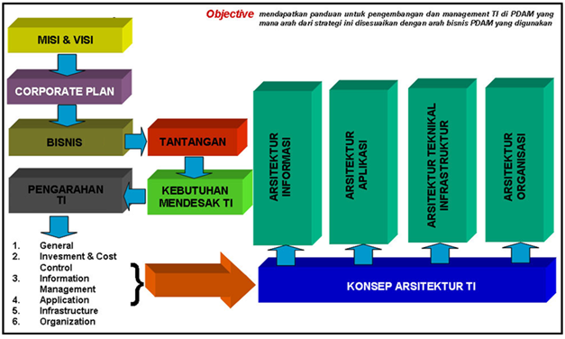

Atas dasar konseptual Penyusunan diatas, maka Metode Penyusunan Pedoman Teknis Tata Kelola TIK dapat ditentukan sebagai berikut:

Gambar 3.7. Metode Metode Penyusunan Pedoman Teknis TataKelola TIK:

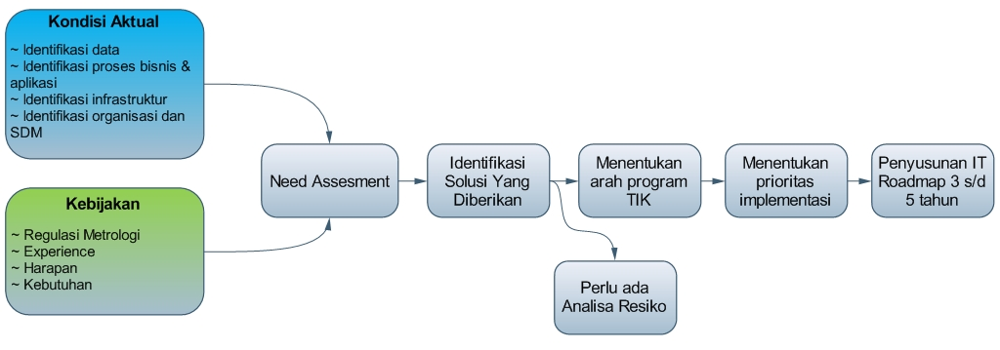

Metodologi Penyusunan Pedoman Teknis Tata Kelola TIK adalah hasil kolaborasi dari **Keputusan MENKOMINFO No. 57/KEPMEN/M.KOMINFO/12/2003** tentang “Panduan Penyusunan Rencana Induk Pengembangan e-Government Lembaga” dengan Diskominfo Provinsi Banten dan penyusunan perencanaan strategis teknologi informasi (_Strategic Planning for Information Systems , John Ward & Joe Peppard, Bedfordshire_, UK).

#### 3.2.4 _Tools_ Penyusunan- _Zachman Framework_

_Zachman Framework_ merupakan _framework_ arsitekural yang paling banyak dikenal dan diadaptasi. Para arsitek data enterprise mulai menerima dan menggunakan _framework_ ini sejak Zachman pertama kali mempublikasikan artikel deskpripsi kerangka kerja di _IBM System Journal_ pada tahun 1987. 
_Zachman Framework_ merupakan matrik 6×6 yang merepresentasikan interseksi dari dua skema klasifikasi–arsitektur sistem dua dimensi. Pada dimensi pertama, _Zachman_ menggambarkannya sebagai baris yang terdiri dari 6 (enam) perspektif yaitu:
  1. **_The Planner Perspective (Scope Context):_** Daftar lingkup penjelasan unsur bisnis yang dikenali oleh para ahli strategi sebagai ahli teori.
  2. **_The Owner Perspective (Business Concept):_** Model semantik keterhubungan bisnis antara komponen-komponen bisnis yang didefenisikan oleh pimpinan eksekutif sebagai pemilik.
  3. **_The Designer Perspective (System Logic):_** Model logika yang lebih rinci yang berisi kebutuhan dan desain batasan sistem yang direpresentasikan oleh para arsitek sebagai desainer.
  4. **_The Builder Perspective (Technology Physics):_** Model fisik yang mengoptimalkan desain untuk kebutuhan spesifik dalam batasan teknologi spesifik, orang, biaya dan lingkup waktu yang dispesifikasikan oleh engineer sebagai builder.
  The Implementer Perspective (Component Assemblies): Teknologi khusus, tentang bagaimana komponen dirakit dan dioperasikan, dikonfigurasikan oleh teknisi sebagai implementator.
  5. **_The Implementer Perspective (Component Assemblies):_** Teknologi khusus, tentang bagaimana komponen dirakit dan dioperasikan, dikonfigurasikan oleh teknisi sebagai implementator.
  6. **_The Participant Perspective (Operation Classes):_** Kejadian-kejadian sistem berfungsi nyata yang digunakan oleh para teknisi sebagai _participant_.

Untuk dimensi kedua, setiap isu perspektif membutuhkan cara yang berbeda untuk menjawab pertanyaan fundamental : _who, what, why, when, where and how_. Setiap pertanyaan membutuhkan jawaban dalam format yang berbeda. Zachman menggambarkan setiap pertanyaan fundamental dalam bentuk kolom. 
  1. **_What_ (kolom data):** material yang digunakan untuk membangun sistem (_inventory set_).
  2. **_How_ (kolom fungsi):** melaksanakan aktivitas (_process transformations_). 
  3. **_Where_ (kolom jaringan):** lokasi, topografi dan teknologi (_network nodes_).
  4. **_Who_ (kolom orang):** aturan dan organisasi (_organization group_).
  5. **_When_ (kolom waktu):** kejadian, siklus, jadwal (_time periods_).
  6. **_Why_ (kolom tujuan):** tujuan, motivasi dan inisiatif (_motivation reason_).

Setiap sel dalam _Zachman Framework_ merepresentasikan tipe yang unik dari artifak desain, didefenisikan oleh interseksi baris dan kolom. Ada beberapa alasan yang menyebabkan _Zachman Framework_ diadaptasi secara luas: 
  1. Relatif sederhana karena hanya memiliki dua dimensi yang mudah untuk dipahami.
  2. Keduanya mengarahkan _enterprise_ kedalam cara yang komprehensif dan mampu mengelola arsitektur untuk divisi individu maupun departemen.
  3. Menggunakan bahasa non teknis yang membantu orang untuk berfikir dan dan berkomunikasi secara lebih tepat.
  4. Dapat digunakan untuk mengkotakkan dan membantu memahami isu yang luas.
  5. Membantu menyelesaikan masalah desain, fokus terhadap detil tanpa kehilangan jalur secara keseluruhan.
  6. Membantu mengajarkan banyak topik sistem informasi yang berbeda.
  7. Merupakan alat perencanaan yang sangat membantu, menyediakan cara untuk pengambilan keputusan yang lebih baik.
  8. Merupakan alat atau metoda khusus yang independen
   
   Gambar 3.8. Zachman Framework:

   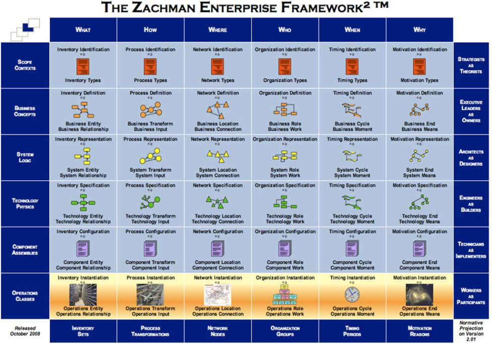

### 3.3 Rencana Kerja

Untuk memastikan berjalannya kegiatan dengan lancar dan dengan sedikit mungkin hambatan, maka diperlukan suatu perencanaan proyek yang dirancang dengan matang dan terstruktur. Hal ini akan sangat membantu dalam menjaga agar batas akhir proyek tidak terlewati. Untuk melakukan hal ini, maka perlu dibuat daftar kegiatan dalam proyek beserta _output_ yang diharapkan dari masing-masing aktivitas, serta jadwal dari masing-masing pekerjaan tersebut.

tabel 3.1: Rencana Kerja Penyusunan Pedoma Teknis Tata Kelola TIK

## 4. PELAKSANAAN kEGIATAN DAN RENCANA TINDAK LANJUT

### 4.1 Pelaksanaan Kegiatan

Kegiatan yang telah dilaksanakan sampai pada penyusunan Laporan Pendahuluan ini, sesuai dengan metodologi keseluruhan kegiatan yang telah diuraikan pada Bagian-3 Pendekatan dan Metodologi Pelaksanaan, adalah:<r>
  1. Persiapan pelaksanaan kegiatan
  2. Rapat Koordinasi Awal (_Project Kickoff Meeting_)
  3. Pembentukan Tim _Counterpart_  Diskominfo Provinsi Banten
  4. Persiapan survey dan koleksi data dan informasi

#### 4.1.1 Persiapan Pelaksanaan Kegiatan

Sebelum kegiatan dimulai, pihak konsultan sudah melakukan persiapan-persiapan yang diperlukan untuk memulai pelaksanaan pekerjaan. Diantaranya adalah menyusun rencana kerja, membentuk tim pelaksana dan organisasi proyek, menyusun materi-materi yang diperlukan untuk _project kickoff_, dan sebagainya.

#### 4.1.2 Rapat Koordinasi Awal (_Project Kickoff Meeting_)

_Project Kickoff Meeting_ telah dilaksanakan di Diskominfo Provinsi Banten. Kegiatan ini dihadiri oleh pihak penyedia jasa konsultan (PT Surya Fokus Teknologi) dan  Diskominfo .Materi yang dibahas pada pertemuan tersebut adalah penyamaan pemahaman dan persepsi mengenai pekerjaan dan pelaksanaan pekerjaan yang tercantum pada notulen dan materi presentai _Project Kickoff Meeting_.

#### 4.1.3 Pembentukan Tim _Counterpart_

Tim _Counterpart_ adalah tim yang terdiri dari tim teknis TIK dan perwakilan dari Diskominfo yang berfungsi untuk mendampingi Tim Konsultan dalam memberikan informasi dan dokumentasi yang terkait dengan pekerjaan. Tim ini bekerja selama proyek berjalan dan telah dibentuk.

#### 4.1.4 Rapat Koordinasi Internal Konsultan

Rapat koordinasi internal konsultan telah dilaksanakan di Kantor Konsultan dengan mengundang seluruh tenaga ahli yang terlibat. 
Materi yang dibahas pada rapat koordinasi internal konsultan adalah persiapan untuk _Project Kickoff Meeting_ dan persiapan dalam rangka pelaksanaan kegiatan dilapangan. 

#### 4.1.5 Persiapan Survey dan Koleksi Data Informasi

Persiapan pendataan dan koleksi dokumen dilaksanakan dengan membuat kuesioner yang antara lain terdiri dari:
   1. Aspek Bisnis proses 
      Aspek Bisnis proses yang dimaksud adalah semua kegiatan bisnis yang dilakukan di lingkungan kerja Diskominfo Provinsi Banten dalam kegiatan pelayanan perijinan, seperti berikut: 
      Data dan/atau informasi yang ingin diperoleh dari kegiatan ini mencakup: 
      - daftar proses bisnis dan deskripsi
      - alur bisnis dan aturan
      - pelaksana dan penanggung jawab 
      - lokasi pelaksanaan
      - waktu pelaksanaan 
      - dokumen pendukung
      - dan lain-lain 
   2. Aspek Data 
      Aspek Data yang dimaksud adalah Segala jenis data baik _softcopy_ maupun _hardcopy_ yang dimiliki dan digunakan dalam kegiatan operasional di lingkungan kerja sesuai dengan proses bisnis yang ada. Data atau informasi yang ingin diperoleh dari kegiatan ini mencakup; 
      - nama/jenis data, 
      - fungsi data, 
      - tempat penyimpanan, 
      - struktur dan format data 
      
      Selain informasi tersebut diperlukan informasi tentang mekanisme pengamanan datanya. 
   3. Aspek Organisasi/Management dan SDM 
      Aspek Organisasi/Managemen adalah fungsi organisasi, uraian tugas pokok dan tanggung jawab serta struktur organisasinya.  
      Aspek SDM mencakup personil yang menduduki jabatan sesuai struktur organisasi dan petugas sesuai dengan proses bisnis yang ada.  
      Data atau informasi yang ingin diperoleh dari kegiatan ini mencakup: 
      - Daftar Fungsi Organinsasi
      - Uraian Tugas setiap Fungsi Organisasi
      - Struktur organisasi
      - Daftar Pejabat dan Petugas beserta kualifikasinya
      - Dan lain-lain
   4. Aspek Infrastruktur 
      Aspek Infrastruktur adalah Infrastruktur yang dimiliki dan digunakan untuk mendukung kegiatan operasional di lingkungan kerja, seperti berikut: 
      - Hardware
      - Software
      - Jaringan dan Komunikasi Data
      - Instalasi dan penempatannya
      - Infrastruktur Lainnya 
      
      Data atau informasi yang ingin diperoleh terkait dengan Infrastrukutur (_Hardware/Software_/Komunikasi Data) mencakup:
      - Fungsi 
      - Jumlah 
      - Spesifikasi
      - Status Kepemilikan 
      - Umur
      - Dan lain-lain 
      
      Disamping informasi tentang infrastruktur diatas, diperlukan juga informasi tentang penempatannya.

tabel 4.1: Usulan Konten

#### 4.1.6 Rencana Tindak Lanjut

Rencana tindak lanjut dari pelaksanaan kegiatan yang telah dilaksanakan sesuai dengan metodologi yang diuraikan pada Bab-3 Pendekatan dan Metodologi Pelaksanaan, adalah:
   1. Menyusun rancangan konten Master Plan IT 
   2. Koleksi data & dokumen IT eksisting
   3. Observasi kebijakan dan regulasi
   4. Focus Group Discussion
   5. Melakukan Analisis
   6. Melakukan verifikasi hasil analisis, konfirmasi dan re-konfirmasi.
   7. Menyusun strategi dan inisiatif pengembangan IT
   8. Menyusun Arsitektur IT
   9. Pelaporan progress kegiatan

## 5. PENUTUP

Demikian laporan pendahuluan ini dibuat, sebagai salah satu hasil yang harus dikeluarkan dari proyek ini kedepan, Semoga dokumen ini dapat memberikan gambaran tentang langkah langkah yang akan di kembangkan dalam bentuk Penyusunan Pedoman Teknis Tata Kelola TIK untuk meningkatkan kinerja di pemerintahan Provinsi Banten kedepan. 
Besar harapan kami agar proses kegiatan  ini dapat berjalan dengan lancar sesuai dengan harapan semua pihak dan selesai pada waktunya. 
Akhir kata kami ucapkan terima kasih atas waktu dan perhatiannya, kami ucapkan terima kasih. 
